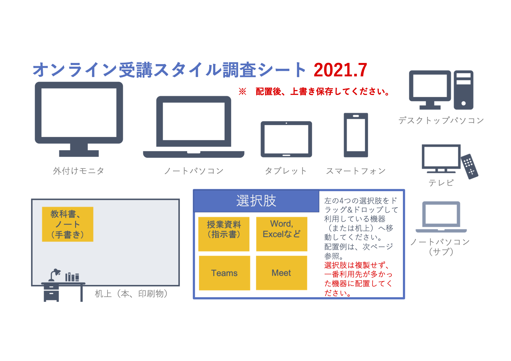

# オンライン受講スタイル調査シート
SSS2021 にて発表した調査に利用した PowerPoint ファイルなど

## ファイル一覧

* `オンライン受講スタイル調査(July)_学生番号.pptx`
  * 学生に配布したファイル
  * アイコン類に触れないように（誤って削除したり、移動してしまったりしないように）背景化している。
  * 選択肢を複製して回答してしまう場合がありました。そうすると集計用のマクロでエラーとなります。たとえば、Meet をスマホと外部モニタで見ていた場合は、主に利用した方 1 つだけを回答させるようにしました。
  * また、なぜか表紙を削除して回答する例がありました。これも集計時にエラーとなりますので、シートを削除しないように注意しました。
* `オンライン受講スタイル調査（各種アイコン背景化前の状態）.pptx`
  * 背景化する前の状態がこのファイル。
* `回収ファイル作業用フォルダ/オンライン受講スタイル調査集計.pptm`
  * 学生から回収したファイルの集計
  * 結果は `選択肢座標.csv` というファイルに書き込まれる
